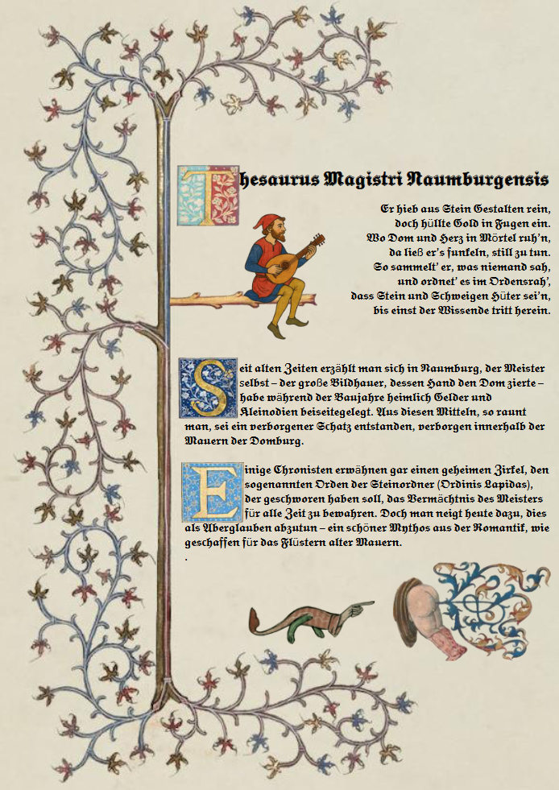
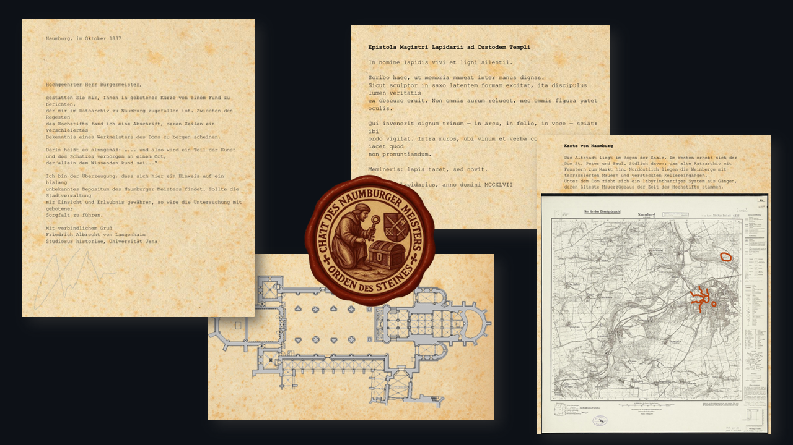

# Der Schatz des Naumburger Meisters – Pen & Paper Szenario

Dieses Pen-&-Paper-Abenteuer wurde **eigenständig erstellt** und ist als historisch angehauchtes, fiktiv-ironisches One-/Few-Shot-Szenario gedacht.

**Epoche:** ca. 1830–1850  
**Ort:** Naumburg (Dom, Ratsarchiv, Stadtkeller, Weinberge)  
**Stil:** historisch, ernsthafte Ermittlungen + trockener Humor  
**System:** leichtgewichtig (W6-Proben)

---

## Szenario: Worum geht’s?

In Naumburg taucht ein rätselhafter Hinweis auf: In alten Archivregesten findet sich eine Abschrift aus Hochstiftszeiten, in der von einem **verborgenen Schatz des Naumburger Meisters** die Rede ist – verborgen „an einem Ort, der allein dem Wissenden kund sei“. Bald formiert sich eine Gruppe Gleichgesinnter, die der Sache nachgeht – doch Genehmigungen, Machtinteressen und eine geheimnisvolle Gegenfraktion erschweren die Suche. 

Das Abenteuer führt die Gruppe in mehreren Stationen durch:
- **Ratsarchiv:** erste Hinweise, verschlüsselte Textfragmente
- **Rathaus / Bürgermeister:** politische Hürden, Genehmigungsdruck, Bestechung oder Diplomatie
- **Dom / Westchor:** Ikonografie, Gesten, religiöse Symbolik
- **Weinberge & Keller / Stadtkeller:** Markierungen, Mechanik, geheime Zugänge
- **Enthüllung:** Fundort + moralische Entscheidung über den Schatz

---

## 🎲 Wie funktioniert das Spiel?

Das System ist bewusst schlank gehalten:

- Jede Figur besitzt **4 Eigenschaften** (Werte 1–6):
  - Verstand
  - Redegewandtheit
  - Handwerk
  - Wille
- **Proben:** 1W6 ≤ Eigenschaft → Erfolg  
- Scheitern bedeutet: **Es passiert trotzdem etwas – aber mit Konsequenz** (Zeitverlust, Misstrauen, Risiko, Sabotage, etc.). 

**Regeln:**  
[`spielregeln.pdf`](spielregeln.pdf) 

---

## 📚 Inhalt / Materialien

### Spielleitung
- **Spielleiterhandbuch (Regie, Dramaturgie, Kapitelstruktur, Hinweise, NPC-Reaktionen):**  
  👉 [`Spielleiterhandbuch_Naumburger_Meister.pdf`](Spielleiterhandbuch_Naumburger_Meister.pdf) 

### Handouts & Rätsel

- Brief/Hook:  [`01_Brief_aus_Jena.pdf`](spielleitungsmaterialien/01_Brief_aus_Jena.pdf) 
- Lateinische Epistel / Flavor & Hinweistext: [`02_Epistola_Magistri_Lapidarii.pdf`](spielleitungsmaterialien/02_Epistola_Magistri_Lapidarii.pdf) 
- Amtsformular (A12) – Bürokratie-/Humor-Handout: [`03_Formblatt_A12.pdf`](spielleitungsmaterialien/03_Formblatt_A12.pdf) 
- Stadtkarte / Orientierung:  [`04_Karte_von_Naumburg.pdf`](spielleitungsmaterialien/04_Karte_von_Naumburg.pdf) 
- Rätsel 1 (Archiv):  [`05_Raetselblatt_I_Archiv.pdf`](spielleitungsmaterialien/05_Raetselblatt_I_Archiv.pdf) 
- Rätsel 2 (Dom):  [`06_Raetselblatt_II_Dom.pdf`](spielleitungsmaterialien/06_Raetselblatt_II_Dom.pdf) 
- Rätsel 3 (Weinberge):  [`07_Raetselblatt_III_Weinberge.pdf`](spielleitungsmaterialien/06_Raetselblatt_II_Dom.pdf) 
- Le Courier de Saxe:  [`09_Le_Courier_de_Saxe.pdf`](spielleitungsmaterialien/09_Le_Courrier_de_Saxe.pdf) 
- Botschaft Fraternitas Lapidis:  [`10_Botschaft_Fraternitas_Lapidis.pdf`](spielleitungsmaterialien/10_Botschaft_Fraternitas_Lapidis.pdf) 
- Gerüchte und Münzen:  [`11_Geruechte_und_muenzen.pdf`](spielleitungsmaterialien/11_Geruechte_und_Muenzen.pdf) 
- Merkblatt und Journal:  [`12_Merkblatt_und_Journal.pdf`](spielleitungsmaterialien/12_Merkblatt_und_Journal.pdf)

### Karte / Grundriss
- Grundriss Dom: [`Grundriss Dom`](spielleitungsmaterialien/grundrissFInal.pdf) 
- Weinkeller Grundriss:  [`08_Weinkeller_Grundriss.pdf`](spielleitungsmaterialien/08_Weinkeller_Grundriss.pdf.pdf) 

---

## 👥 Spielbare Charaktere

Die Charaktere sind als Dossier/Akten vorbereitet und bringen jeweils ein Spezialgebiet mit (Wissen, Beziehungen, Mechanik, etc.). Die Sonderfähigkeiten sind absichtlich **direkt spielrelevant**, damit die Gruppe sich ergänzt. 

👉 **Charakterakten:** [`charakterakten_dossier.pdf`](charakterakten_dossier.pdf) :contentReference[oaicite:12]{index=12}

Beispiele für enthaltene Figuren:
- **Friedrich A. von Langenhain** – Geschichtsstudent / Textdeuter
- **Dr. Wilhelm Reuß** – Archivrat / Hüter der Schrift
- **Clemens von Hagen** – Domherr / Segen oder Bann
- **Leopold Drechsler** – Kaufmann / überzeugende Bestechung
- **Karl Möller** – Weinbauer / Kellerinstinkt
- **Gustav Hempel** – Ingenieur/Uhrmacher / Meister der Mechanik
- **Elise Falkenberg** – Schauspielerin/Sängerin / Betörender Auftritt
- *(weitere im Dossier)*

---

## 🕯️ Hinweise für die Spielleitung

### Ton & Spielgefühl
Dieses Abenteuer lebt von einer Mischung aus:
- historischer Ernsthaftigkeit
- investigativer Logik
- trockener Ironie (vor allem in Bürokratie- und Obrigkeitsszenen) 

**Spielt es nicht als Slapstick.**  
Der Humor sollte „preußisch höflich“ bleiben: lächelnde Formulierungen, absurd korrekte Formulare, unangenehm korrekte Beamte.

---

### Spielleitung = Dramaturgie-Archiv
Du bist nicht Gegner*in der Gruppe, sondern:
- Regisseur*in,
- Hinweis-Verteiler*in,
- Brandmeister*in für Eskalationen.

Wenn die Gruppe abdriftet: **lass die Welt reagieren** (Zeitdruck, Fraktion handelt, Zugang wird erschwert, Gerüchte entstehen). :contentReference

---

### Hinweise und Rätsel: so leitest du fair
- Jede zentrale Plotfrage sollte **mind. 3 Wege** haben, um den Hinweis zu erhalten.
- Gib bei Blockaden:
  - Gerüchte,
  - Nebenakten,
  - NSC-Beobachtungen,
  - vereinfachte Teilhinweise. 

> Wichtig: Das Spiel ist auf Fortschritt ausgelegt. Scheitern heißt NICHT Stillstand.

---

### Fraktion / Gegenkräfte richtig einsetzen
Es gibt eine diskrete Gegenfraktion (Orden/Fraternitas), die nicht „Bossfight“, sondern **Schatten-Druck** ist:
- beobachten
- sabotieren (Markierungen, Kreide, Gerüchte)
- Verzögerung erzeugen
- moralischen Druck aufbauen

Du solltest sie **reaktiv** spielen: Je mehr die Gruppe aufdeckt, desto aktiver wird die Fraktion.

---

## 🧰 Materialeinsatz (Praxis)

Empfehlung:
- Drucke die Handouts aus und lege sie in Umschläge.
- Teile Dokumente zeitlich passend aus (wie in einer echten Ermittlungsakte).
- Nutze Licht, Musik oder Timer, um Locations zu unterscheiden (Archiv ruhig / Keller bedrückend).

**Typischer Ablauf:**
1. Brief aus Jena als Einstieg
2. Archiv-Rätsel → Dom-Hinweis
3. Rathaus/Genehmigung (Formblatt als Humoranker)
4. Dom-Rätsel + Karte + Grundriss
5. Keller/Mechanik → Finale Enthüllung

---

## ✅ Quickstart (für 1 Abend)

1. Lies Kapitelübersicht im SL-Handbuch
2. Drucke:
   - Charakterakten
   - Brief
   - Rätsel I + II
   - Stadtkarte + Grundriss
3. Erkläre Regeln in 5 Minuten
4. Starte sofort im Ratsarchiv

---

## 📜 Lizenz / Nutzung
Dieses Projekt ist ein Fan-/Hobbyprojekt und frei nutzbar für private Spielrunden.  
Bei Weiterverwendung oder Anpassung: Credits sind gern gesehen. ❤️
